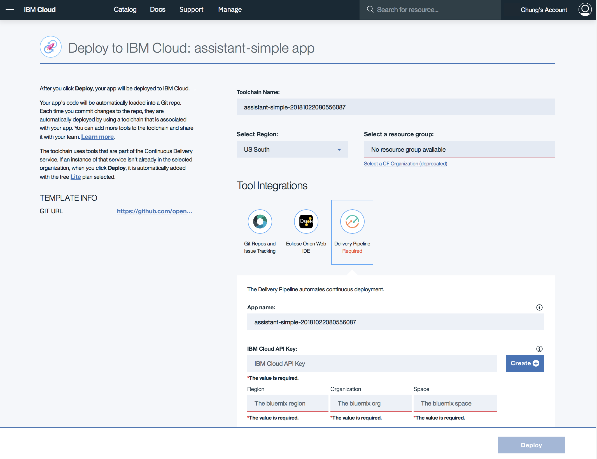

<h1 align="center" style="border-bottom: none;">🚀 Watson Assistant (formerly Conversation) Sample Application</h1>
<h3 align="center">This Node.js app demonstrates the Watson Assistant service in a simple chat interface simulating a cognitive car dashboard. This is forked from https://github.com/watson-developer-cloud/assistant-simple . Basic authentication is added to demostrate authenticated chat bot.</h3>

##  Steps to deploy the Watson Assistant Sample Application

1. Sign up for an [IBM Cloud account](https://console.bluemix.net/registration/).

1. Create an instance of the Watson Assistant service and get your credentials:
    - Go to the [Watson Assistant](https://console.bluemix.net/catalog/services/conversation) page in the IBM Cloud Catalog.
    - Log in to your IBM Cloud account.
    - Click **Create**.
    - Click **Show** to view the service credentials.
    - Copy `username` and `password` values 

1. Click on the Deploy to IBM Cloud button below:  

1. The Deploy to IBM Cloud configuration should shown as below:  
   

1. In the Deploy to IBM Cloud: assistant-simple app, make sure the following input are filled correctly:   
   -  Toolchain Name
   -  Select Region  
      - Select US South, if it is not filled.
   -  Select a resource group  
      - click on th "Select a CF Organization (deprecated)" option below if it is not filled.

1. Click on the  to create the IBM Cloud API Key, make sure the API key is filled after creation.

1. Ensure that the following fields are filled:  
   - Region  
   - Organization
   - Space

1. Create on the  to deploy the Application to IBM Cloud, it will take a while... Please do not close the browser.

1. Once the application is successufully or failed deployed to IBM Cloud  continue the next section to configure the application.

### Configuring the application

1. Open [IBM Cloud console](http://console.bluemix.net) if it is not already opened. 

1. Select the  on the top right corner to get the Menu option.

1. Select the dashboard in the Menu option to open the IBM cloud dashboard.

1. Select the Assistant-Simple application that was just deployed under cloud foundry applications section

1. In the Wealth-Portfolio-Management application console, select Runtime.

1. Select the Environment variable tab in the top center of the screen and set up the following User defined Environment variables in the NAME and VALUE table accordingly:  

   | NAME                   |  VALUE                                       |
   |------------------------|:---------------------------------------------|
   | ASSISTANT USERNAME     | value from Watson Assistant user name        |
   | ASSISTANT PASSWORD     | value from Watson Assistant password         |
   | WORKSPACE_ID           | value from Watson Assistant Workspace Id     |
   | AUTHORIZED_USERS       | test:password                                |

1. After filling up the NAME and VALUE the screen should look something like below:  
   

1. The parameter AUTHORIZED_USERS is to set the user name and password to log in to the chat bot, the format is userId:password

1. Once completed setting the above save and restart the application

1. Once the application is restarted, click on the "Visit App URL" in the top left corner

1. Enter the user name and password according to the AUTHORIZED_USERS entry.
